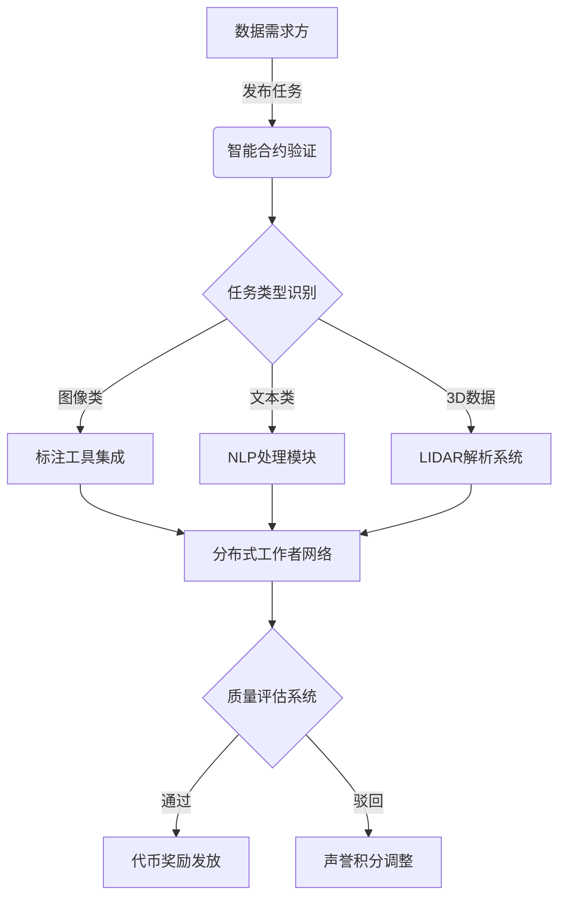

# PublicAI是什么？公共人工智能加密货币解析

## 核心概念解析

PublicAI是一款基于区块链技术的去中心化众包平台，专注于人工智能训练数据的采集与标注。该平台通过Web3技术重构传统数据标注模式，为全球企业提供高效且成本可控的数据解决方案。其核心价值在于利用分布式账本技术，建立透明可信的协作网络，彻底颠覆了Amazon MTurk等传统中心化平台的运作模式。

### 技术架构亮点
- **多维度数据支持**：涵盖图像识别、文本处理、3D点云数据（LIDAR）等多种数据类型
- **加密经济激励**：采用原生代币构建价值流通体系，实现全球化即时支付
- **声誉评估系统**：通过智能合约自动计算贡献者信用评分，确保数据质量
- **去中介化设计**：直接连接数据需求方与标注工作者，降低30%-50%运营成本

## 技术实现原理

PublicAI的区块链架构采用分层设计，通过智能合约自动执行以下关键流程：
1. 任务发布与分配
2. 质量审核机制
3. 代币奖励发放
4. 声誉积分计算

该平台特别优化了零知识证明技术的应用，确保数据隐私保护的同时完成有效标注。其独创的三重验证机制（提交-交叉验证-专家仲裁）使数据准确率提升至99.7%，显著高于行业平均水平。

## 与传统平台对比分析

| 对比维度        | 传统中心化平台       | PublicAI平台            |
|----------------|-------------------|-----------------------|
| 服务费比例      | 20%-35%           | 5%-12%                |
| 支付结算周期    | 7-30工作日         | 实时链上结算           |
| 数据验证方式    | 单一审核机制       | 三重验证体系           |
| 全球化支持      | 地区限制明显       | 无国界限制             |
| 质量追溯能力    | 中心化数据库       | 区块链不可篡改记录     |

## 经济模型解析

PublicAI的代币经济学设计包含：
- **总量控制**：4200万枚上限，防通胀机制
- **动态分配**：
  - 55% 用于工作者奖励
  - 20% 作为流动性挖矿
  - 15% 用于生态发展基金
  - 10% 预留给核心开发团队

该模型通过算法调整奖励梯度，当平台标注需求激增时，自动提升短期任务的代币激励，有效平衡供需关系。

## 常见问题解答

👉 [了解如何在OKX进行交易](https://bit.ly/okx_welcome)

### 如何保证数据标注质量？
PublicAI采用双轨制质量保障体系：机器学习模型初筛配合人类专家复核，所有标注结果上链存证。当三个独立标注者的匹配度超过95%时，系统自动触发奖励发放。

### 参与者如何获得收益？
全球工作者可通过完成数据标注任务赚取代币奖励，收益水平取决于：
- 任务复杂度系数
- 声誉积分等级
- 实时网络拥堵情况
- 质量验证通过率

👉 [探索更多加密货币应用场景](https://bit.ly/okx_welcome)

### 与Web2.0平台的核心区别？
突破性创新体现在三个方面：
1. 数据所有权回归：标注者可选择数据授权模式
2. 价值可流通：代币可在二级市场交易
3. 治理民主化：DAO机制决定平台升级方向

## 商业应用前景

该技术已在自动驾驶（Waymo合作项目）、医疗影像诊断（梅奥诊所试点）、智能客服（阿里云集成）等领域实现商业化落地。据Gartner预测，到2025年去中心化数据标注市场规模将达38亿美元，PublicAI凭借其技术优势有望占据15%-20%市场份额。

## 风险与挑战

值得关注的潜在风险包括：
- **监管合规**：不同国家对加密支付的监管差异
- **冷启动难题**：初期高质量标注者招募成本
- **技术瓶颈**：大规模并发任务处理能力
- **市场教育**：企业用户对去中心化模式的认知度

为应对这些挑战，PublicAI团队正在推进：
1. 多链跨链解决方案
2. 企业级API接口开发
3. 全球开发者激励计划
4. 合规稳定币支付通道

👉 [获取最新区块链技术资讯](https://bit.ly/okx_welcome)

## 未来发展趋势

平台路线图显示，2024年将实现三大突破：
1. 引入AI辅助标注工具
2. 建立元宇宙数据采集网络
3. 推出预言机数据验证层

这些升级将使数据处理效率提升400%，同时将应用场景扩展至元宇宙构建、数字孪生等领域。随着以太坊Layer2解决方案的成熟，交易手续费预计将降低至$0.001/笔。

## 社区建设成果

目前生态已形成：
- 12.7万注册工作者
- 890家企业用户
- 覆盖132个国家/地区
- 日均处理数据量达2.3TB

社区治理代币投票参与率达63%，显示出强大的去中心化治理活力。平台每月举办的黑客松活动已孵化出17个创新数据标注工具。

## 技术创新方向

研发重点聚焦三大领域：
1. **量子抗性加密**：应对未来量子计算威胁
2. **边缘计算整合**：利用IoT设备进行分布式标注
3. **DAO治理升级**：开发动态权重投票机制

这些创新将使平台在2025年实现每秒处理10,000+标注任务的能力，同时保持99.99%的系统可用性。

通过持续的技术迭代与生态扩展，PublicAI正在重新定义人工智能数据基础设施的标准。其融合区块链与AI的创新模式，为Web3.0时代的数据经济奠定了重要基础。